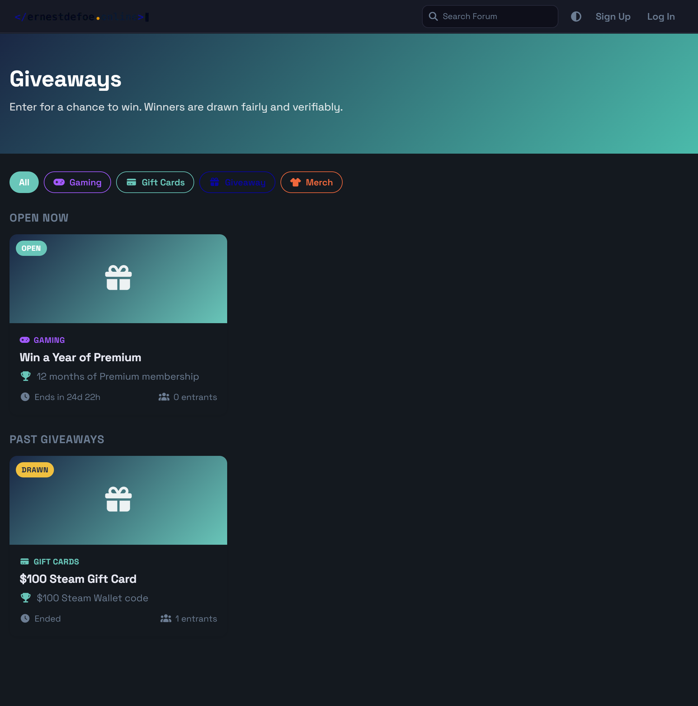
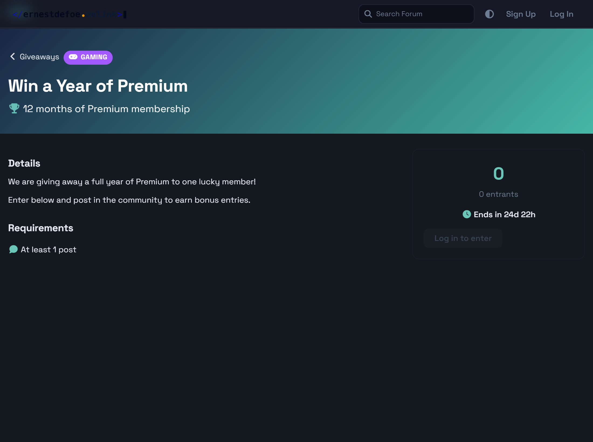
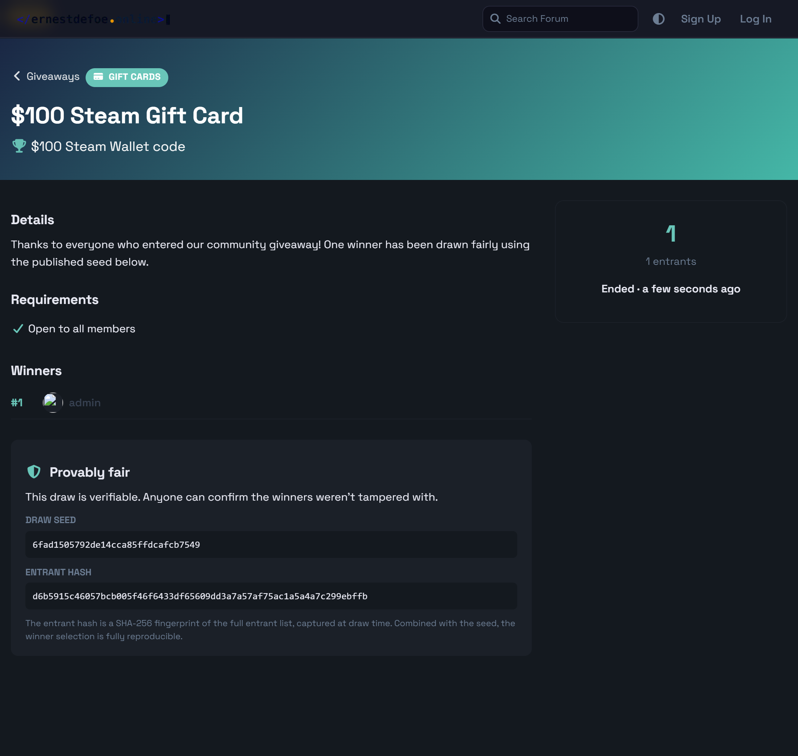

# Giveaways

[](./LICENSE)
[](https://packagist.org/packages/ernestdefoe/giveaways)

Run **provably-fair giveaways** on your [Flarum](https://flarum.org) community. Members enter with one click, earn bonus entries for being active, and winners are drawn automatically — with a published seed and entrant fingerprint anyone can verify.




## Features

- 🎁 **Beautiful giveaways page** — a dedicated `/giveaways` page with cards, live countdowns, status badges and entrant counts.
- 🎟️ **One-click entry** — registered members enter instantly. The button shows their current entry count.
- ⭐ **Earn-entries engine** — grant a one-time bonus when entrants post in the community, rewarding real activity.
- 🗂️ **Categories** — organise giveaways into colour-coded categories with filter pills, badges and an inline manager.
- 🎯 **Eligibility rules** — optionally require a minimum post count or account age to enter.
- ⏱️ **Scheduled auto-draw** — set an end time and the winners are drawn automatically by the scheduler. Hosts can also **draw now** at any time.
- 🔔 **Winner notifications** — every winner gets an in-app alert linking straight to the giveaway.
- 📦 **Prize claiming** — winners get a "You won!" banner with a one-click **Claim** button; the host is notified and can see per-winner claim status, plus optional claim instructions (e.g. "DM me your address").
- 🛡️ **Provably fair** — every draw publishes a random **seed** and a **SHA-256 hash** of the full entrant list, so the result is independently reproducible and tamper-evident.
- 🏆 **Multiple winners** — draw any number of weighted winners in a single fair pass.
- 🔐 **Granular permissions** — separate *enter*, *create own*, and *manage all* permissions.

## Screenshots

### Giveaway page — enter, requirements & live countdown



### Provably-fair results — published winners, seed & entrant hash



## Installation

```sh
composer require ernestdefoe/giveaways
```

Then enable **Giveaways** in your admin panel and review the permissions grid.

> **Scheduled draws require Flarum's scheduler to be running.** Add this to your server's crontab:
> ```
> * * * * * cd /path/to/flarum && php flarum schedule:run >> /dev/null 2>&1
> ```
> Without it, giveaways won't auto-draw at their end time — but you can still draw manually from each giveaway page.

## Updating

```sh
composer update ernestdefoe/giveaways
php flarum migrate
php flarum cache:clear
```

## How the fair draw works

When a giveaway is drawn:

1. The full entrant list is serialized in a fixed order (`userId:entries`, sorted by user id) and hashed with **SHA-256** — this is the **entrant hash**.
2. A random **seed** is generated.
3. For each winner slot *i*, the winner is chosen by `SHA-256(seed:i)` reduced over the weighted entry pool, removing each winner before the next pick.

Because the seed and entrant hash are published on the giveaway page, anyone can re-run the algorithm and confirm the winners were not manipulated.

## Permissions

| Permission | Default | Description |
|---|---|---|
| `giveaways.enter` | Members | Enter giveaways |
| `giveaways.create` | Admins | Create and manage **own** giveaways |
| `giveaways.manage` | Admins | Manage **all** giveaways |

## Settings

- **Show a "Giveaways" link in the main navigation** — toggle the nav item.
- **Navigation label** — customise the link text.

## License

[MIT](./LICENSE) © ernestdefoe
